# MODBUS TCP/IP Communication — Arduino & STM32 (W5500)

As an EE492 graduation project at Izmir Institute of Technology, we implemented the Modbus TCP/IP protocol on Arduino (ATmega328P) and STM32F4 microcontrollers, plus a Python/Tkinter GUI to act as the master device. We wrote our own functions directly from the protocol documentation — **no external Modbus library is used on either side.**

Project by **Yahya Ekin** and **İlker Keser** (advisor: Ergün Gözek).

The full write-up and a one-page summary are in this repo:
[`EE492 Modbus TCPIP Communication Project Report Final.pdf`](<./EE492 Modbus TCPIP Communication Project Report Final.pdf>) · [`EE492 Project Poster.pdf`](<./EE492 Project Poster.pdf>)

---

## Protocol structure

Modbus TCP/IP wraps a standard Modbus PDU (function code + data) inside an MBAP header carrying the transaction ID, protocol ID, length, and unit ID. No CRC is needed, since TCP already guarantees the data:

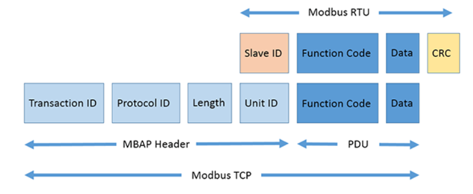

Every transaction follows the same request → action → response shape between client and server:

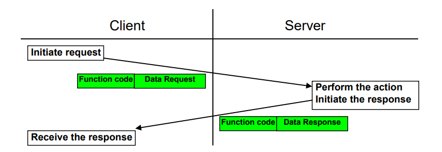

### Function codes implemented

| Function | Code | Purpose |
|---|---|---|
| Read Coils | `0x01` | Reads the status of connected coils on the slave |
| Read Discrete Inputs | `0x02` | Reads the status of connected digital inputs |
| Read Holding Registers | `0x03` | Reads the slave's holding (memory) registers |
| Read Input Registers | `0x04` | Reads the slave's input (analog) registers |
| Write Single Coil | `0x05` | Drives a single coil on the slave |
| Write Single Register | `0x06` | Writes a single holding register on the slave |

Exception handling follows the standard Modbus flow: invalid function codes, out-of-range addresses, and out-of-range quantities each return the matching exception code instead of a malformed response.

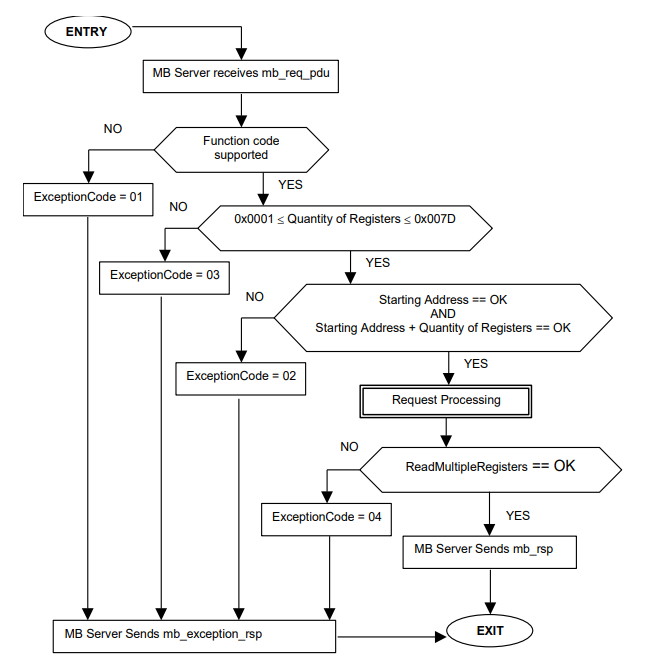

---

## Architecture

**Master — Python / Tkinter.** The GUI sets the slave's IP/port/unit ID, lets you pick a function and fill in its parameters, then packs the PDU, prepends the MBAP header, opens a TCP socket, and decodes whatever comes back:

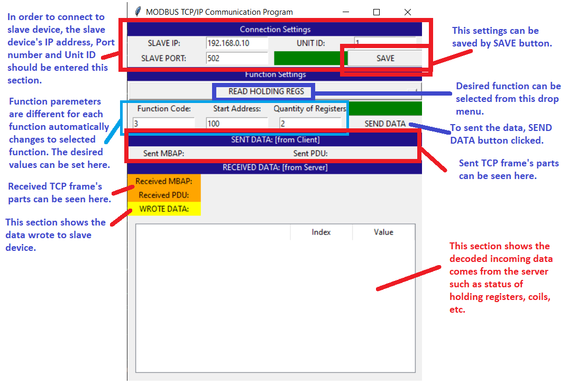

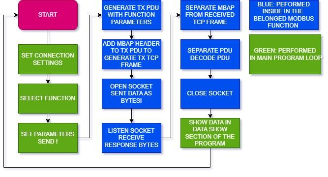

**Slave — Arduino Nano + W5500, and STM32F4 + W5500.** The slave configures the W5500 over SPI (MAC / IP / subnet / gateway), opens a socket, and on every received frame splits the MBAP from the PDU, checks the unit ID and function code, and dispatches to the matching handler:

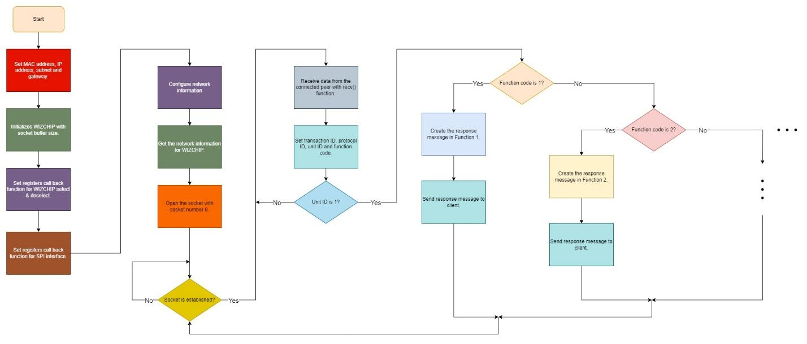

---

## Hardware setup

Arduino Nano + W5500 module on a breadboard, with 2 LEDs standing in for coils, 2 push-buttons for discrete inputs, and 2 potentiometers for analog inputs:

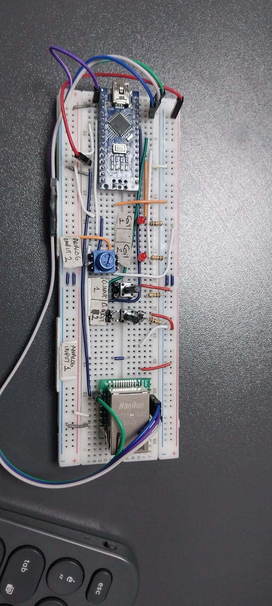

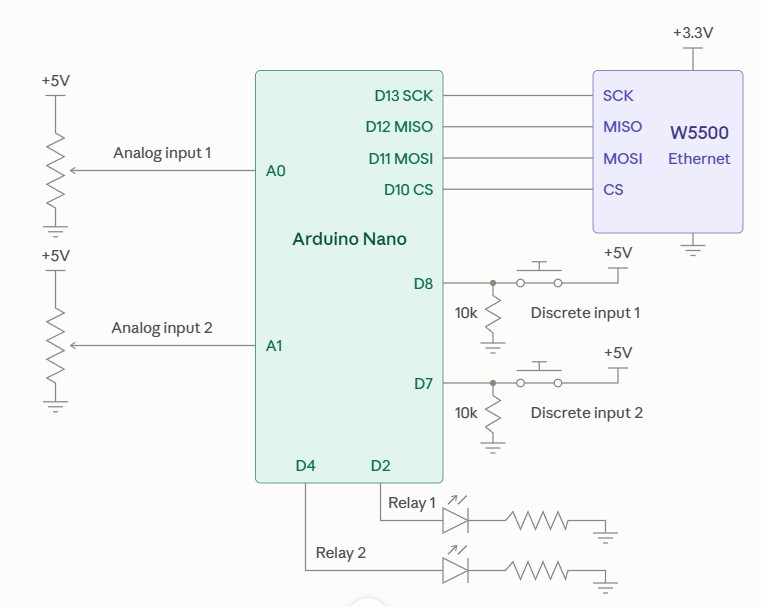

---

## Code highlights

**Parsing an incoming request (Arduino / STM32, C)** — splitting the MBAP header from the PDU and reading the transaction/protocol IDs, unit ID, and function code:

```c
uint8_t receive_message[12];
recv(socketNumber, (uint8_t *)receive_message, 12);

unsigned short transaction_id = (receive_message[0] << 8) | receive_message[1];
unsigned short protocol_id    = (receive_message[2] << 8) | receive_message[3];
unsigned short t_length       = (receive_message[4] << 8) | receive_message[5];
byte unit_id       = receive_message[6];
byte function_code = receive_message[7];

if (unit_id == 1) {
  byte MBAP[7];
  MBAP[0] = highByte(transaction_id);
  MBAP[1] = lowByte(transaction_id);
  MBAP[2] = highByte(protocol_id);
  MBAP[3] = lowByte(protocol_id);
  MBAP[6] = unit_id;
  // MBAP[4..5] (length) is filled in per function, once the response size is known

  if (function_code == 1) {
    // ... dispatch to READ_COILS, etc.
  }
}
```

**Building the response — Read Holding Registers, function `0x03` (C, shared logic between the Arduino and STM32 builds):**

```c
//03 (0x03) Read Holding Registers
uint8_t *READ_H_REGS(uint8_t function_code, uint8_t start_address, uint8_t quantity_of_inputs)
{
  // RES_PDU length = 2*quantity_of_inputs (1 byte * 2) + byte_count (1 byte) + function_code (1 byte)
  int length_res_pdu = 2 * quantity_of_inputs + 1 + 1;
  uint8_t *RES_PDU_3 = malloc(length_res_pdu * sizeof(uint8_t));

  uint8_t byte_count = 2 * quantity_of_inputs;
  RES_PDU_3[0] = function_code;
  RES_PDU_3[1] = byte_count;

  for (int i = 0; i < quantity_of_inputs; i++) {
    RES_PDU_3[(2*i)+2] = highByte(HOLDING_REGISTERS[start_address + i]);
    RES_PDU_3[(2*i)+3] = lowByte(HOLDING_REGISTERS[start_address + i]);
  }
  return RES_PDU_3;
}
```

**Building the matching request — Read Holding Registers (Python, master side):**

```python
def READ_H_REGS(function_code, start_address, quantity_of_inputs, SLAVE_IP, SLAVE_PORT, UNIT_ID):
    if not 1 <= int(quantity_of_inputs, 16) <= 125:
        raise ValueError('quantity_of_registers out of range (valid from 1 to 125)')

    tx_pdu = struct.pack('>BHH', int(function_code, 16),
                          int(start_address, 16), int(quantity_of_inputs, 16))

    transaction_id = 1
    protocol_id = 0
    length = len(tx_pdu) + 1
    mbap = struct.pack('>HHHB', transaction_id, protocol_id, length, UNIT_ID)
    tx_frame = mbap + tx_pdu

    try:
        sock.send(tx_frame)
    except socket.timeout:
        sock.close()
    except socket.error:
        sock.close()
```

---

## Results

Validated against three different slave targets and a raw TCP tool, checking the exchanged bytes each time:

**Python master ↔ Schneider M221 PLC** — the PLC as the slave device, ladder program running alongside:

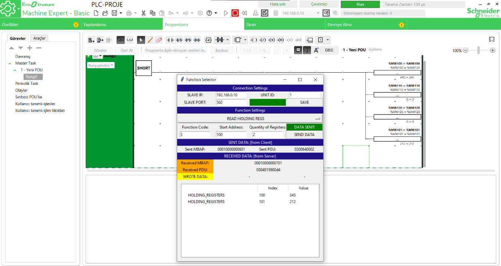

**Python master ↔ Arduino Nano slave**, with the Arduino serial monitor showing the frame arriving and being parsed byte-by-byte:

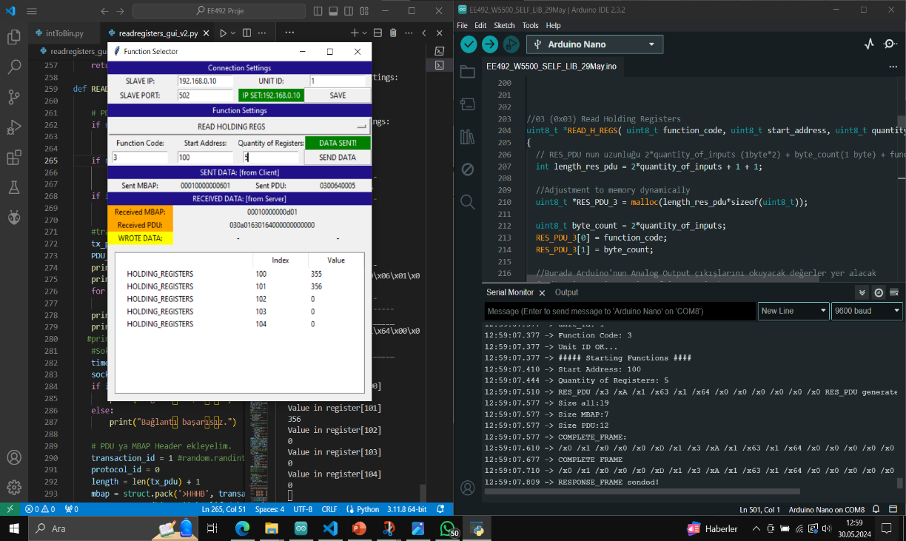

**Python master ↔ STM32F4 Discovery slave**, stepping through the same `READ_H_REGS` handler in STM32CubeIDE:

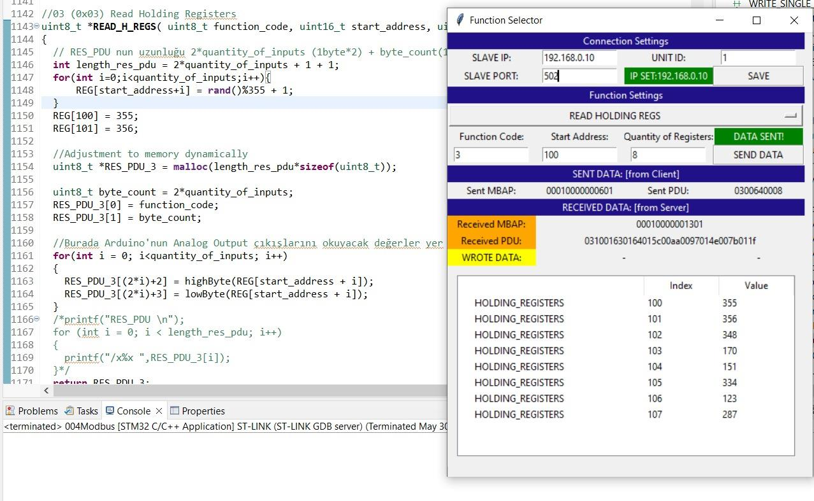

**Hercules TCP client ↔ STM32F4 slave** — sending raw hex Modbus frames directly, bypassing the Python GUI, to confirm the slave's byte-level parsing independent of our own master implementation:

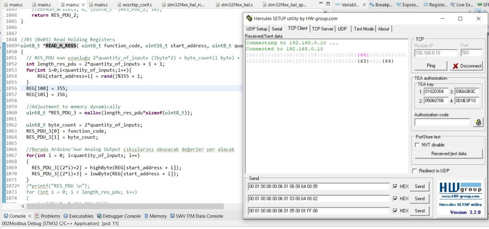

---

## Repository contents

- `EE492_W5500_SELF_LIB_29May/` — Arduino/STM32 slave firmware, plus the WIZnet `W5500`/`W5100`, socket, and `wizchip_conf` driver files
- `EE492_MBUS_TCPIP_GUI.py` — Python/Tkinter master
- `EE492 Modbus TCPIP Communication Project Report Final.pdf` — full report
- `EE492 Project Poster.pdf` — one-page project poster
- `SETUP circuit diagram.jpg`, `setup.jpg` — wiring reference and hardware photo
